# An Intro

## What is Shiny? {.columns-2 .smaller}

- an **R package** for building an **interactive web apps** straight from R.
- can be hosted as a **standalone** apps on a webpage ; or **embed** them in R Markdown documents ; or build **dashboards**.
- can be extended with **CSS themes**, **htmlwidgets**, and **JavaScript actions**.

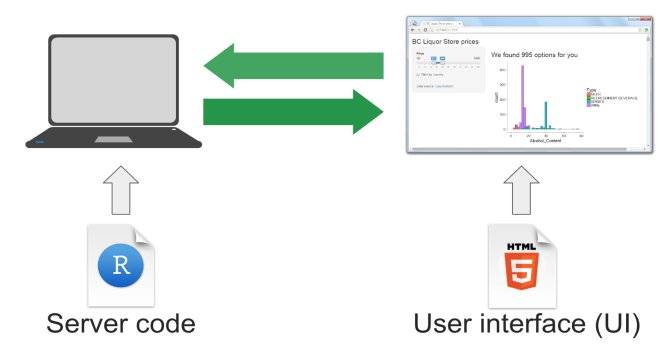{width=100%}

## Why Shiny? {.build}

1. Interactive 
2. Animated

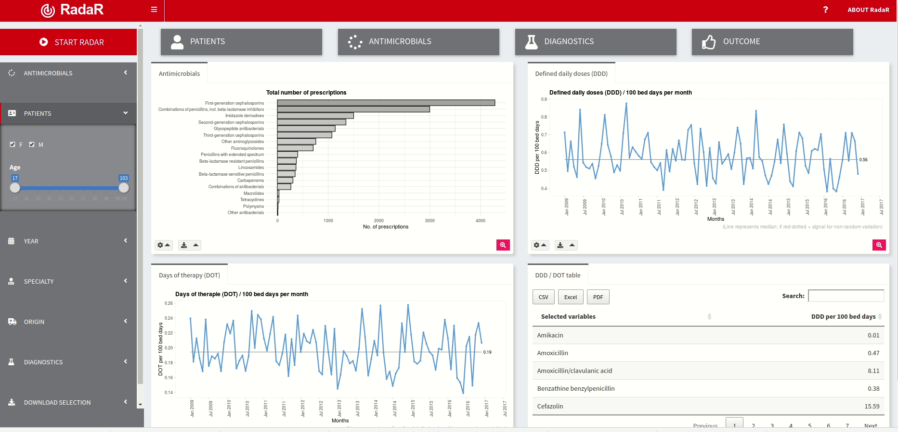

# Enough with Theory, Let's get our hands dirty


## 4 Easy Steps to Build a Shiny App {.build}

1. Load the Shiny library
   ```{r eval=FALSE}
   install.packages('shiny')
   library('shiny')
   ```
2. create the UI
3. create the server
4. combine the UI and server 

```{r eval=FALSE}
library(shiny) 
ui <- fluidPage(...) 
server <- function(input, output, session) {...} 
shinyApp(ui = ui, server = server)
```

# Let's walk through it

## Warming Up {.build}

### a "Hello, world" Shiny app


## User Interface {.build}

**Concept**: Input - Output - Render

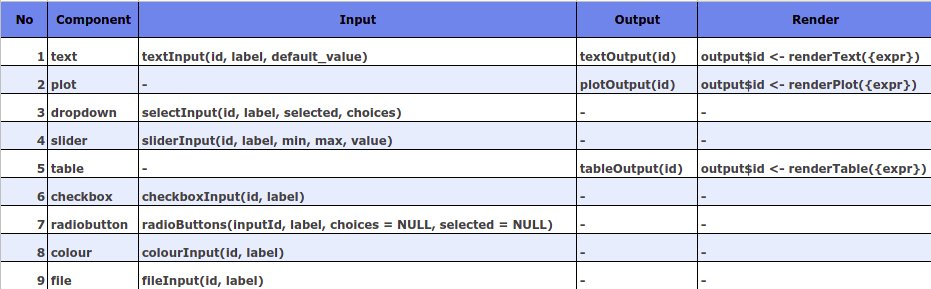

---

See the complete list on [Shiny Cheatsheet](https://github.com/rstudio/cheatsheets/raw/master/shiny.pdf). 

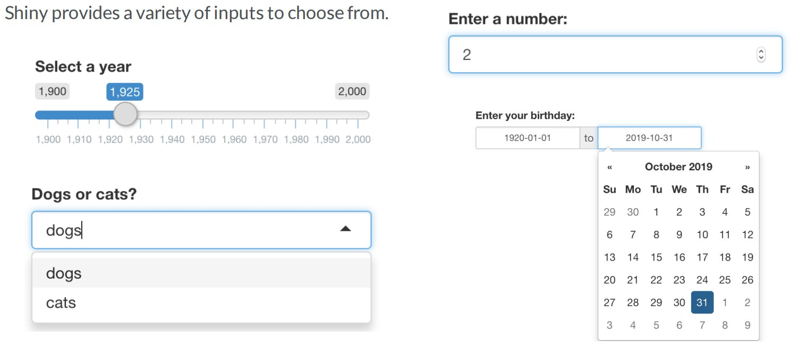

## TextInput {.build}

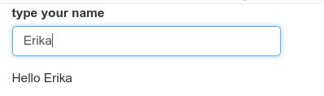

## Adding Plot Container {.build}

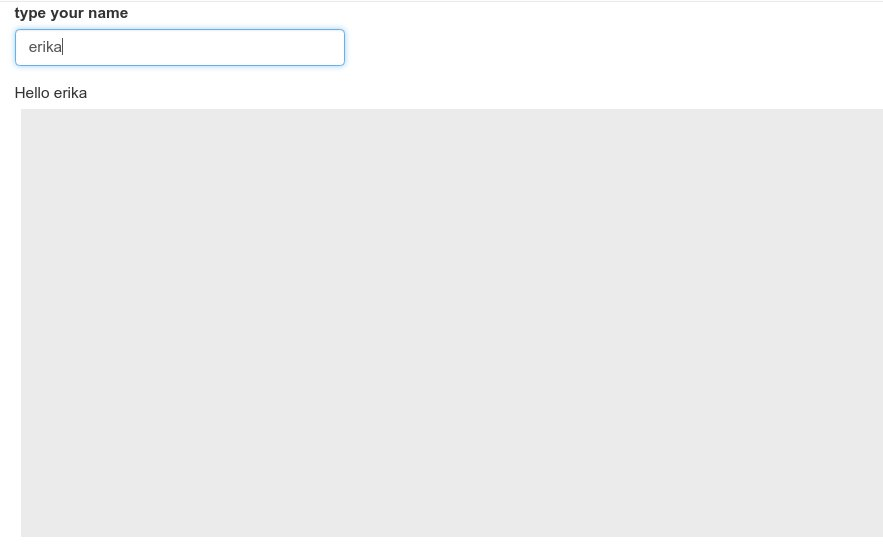

## Layouting {.build}

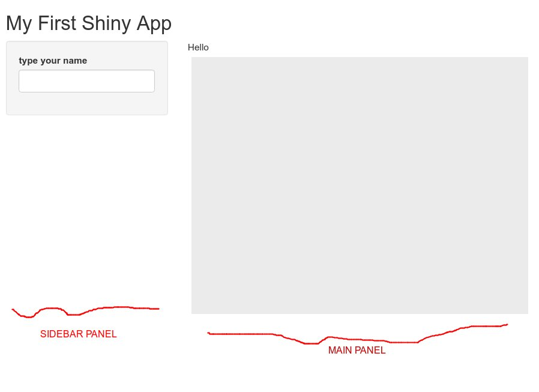

## Let's Practice with Babynames {.build}

babynames is a package contains US Baby Names used for at least 5 children of either sex, from the year of 1880-2017.

```{r eval=FALSE}
install.packages('babynames')
library(babynames)
```

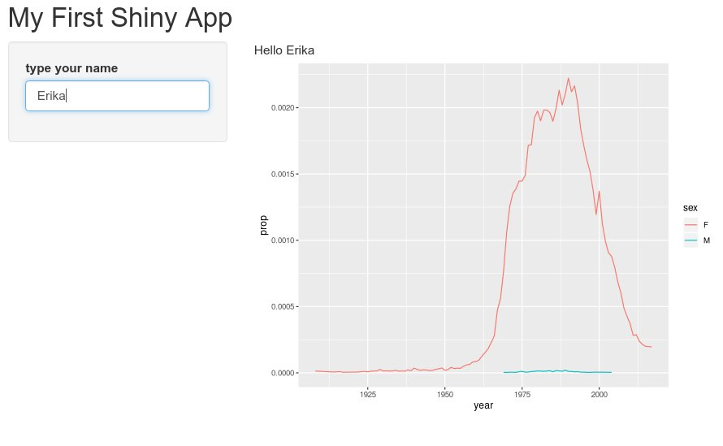

## Select Input {.build}


## Slider {.build}

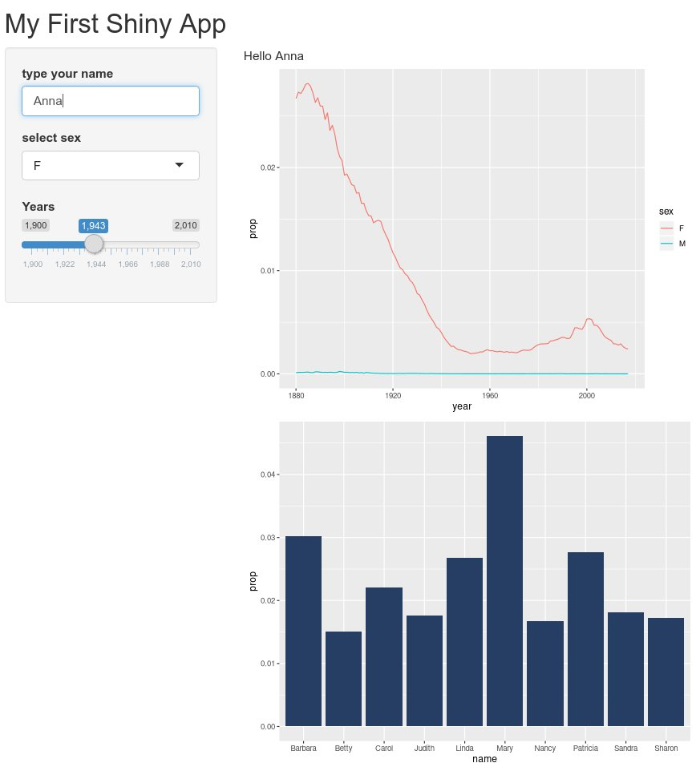

## tableOutput {.build}

*Beware of the reactive variables*

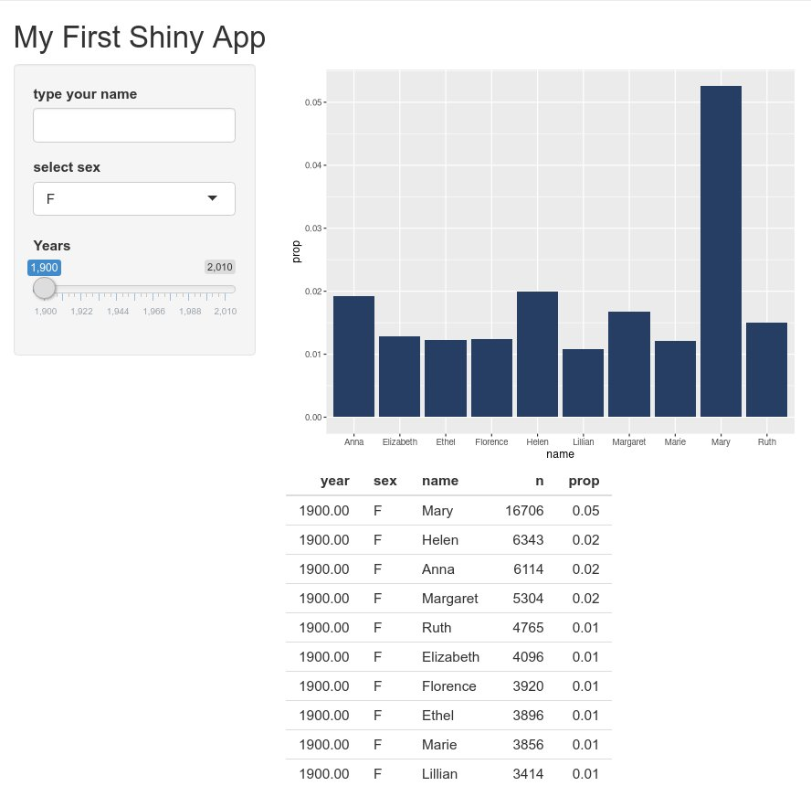
    
## Other option for Table {.build}

Using the package `DT`. 

```{r eval=FALSE}
  install.packages('DT')
  library('DT')
```

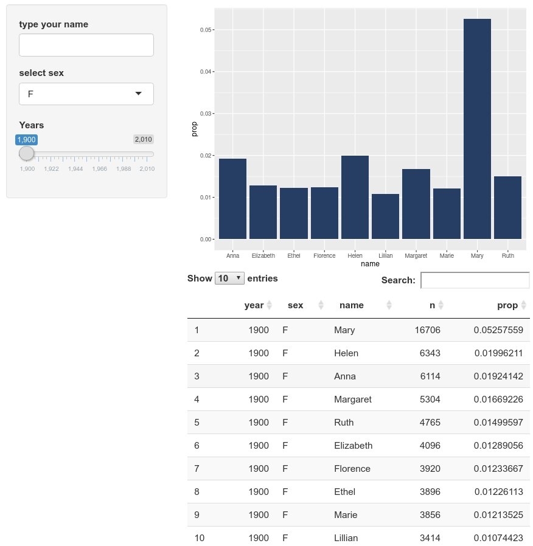{width=60%}

## Interactive plot with plotly {.build}

```{r eval=FALSE}
  install.packages('plotly')
  library('plotly')
```

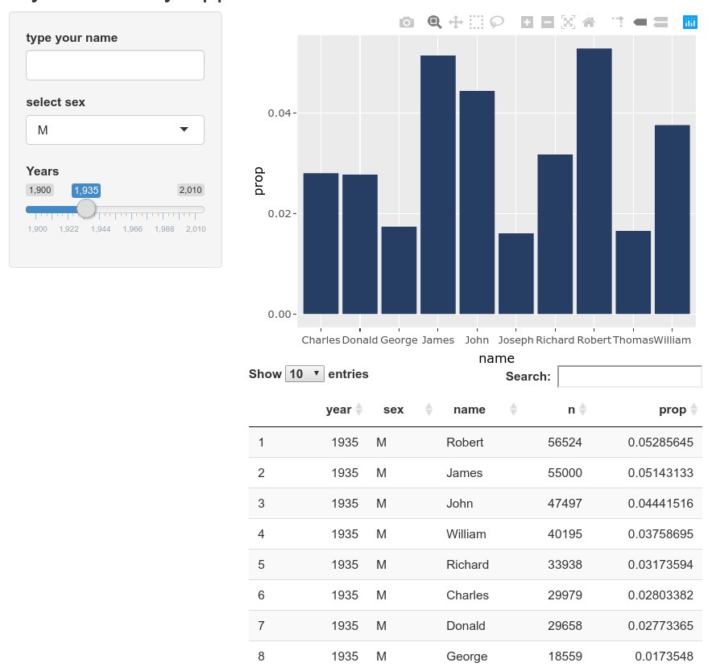{width=60%}

## Working with Tabs {.build}

```{r eval=FALSE}
  ui <- fluidPage(
  sidebarLayout(
    sidebarPanel(___),
    mainPanel(
      tabsetPanel(
        tabPanel("tab_label_1" , ___),
        tabPanel("tab_label_2" , ___)
      ))))
```

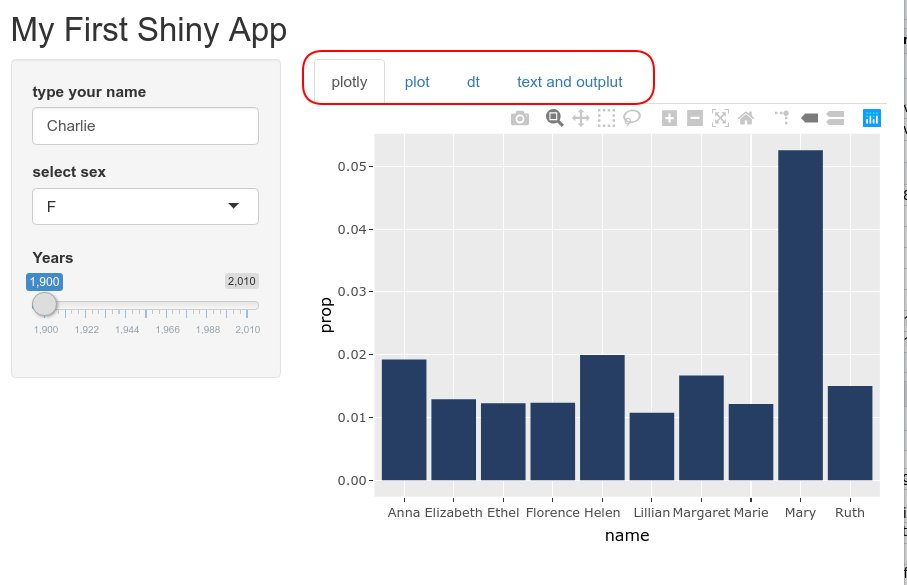

## Play with Themes {.build}

```{r eval=FALSE}
install.packages('shinythemes')
library('shinythemes')
```

```{r eval=FALSE}
  shinythemes::themeSelector()  # option 1
  theme = shinythemes::shinytheme('superhero')  # option 2
```
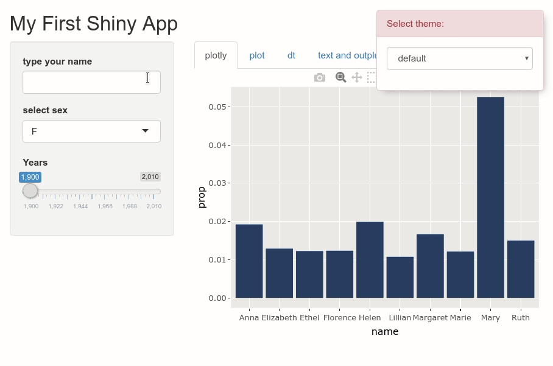

## Bonus: Greeting Card {.build}

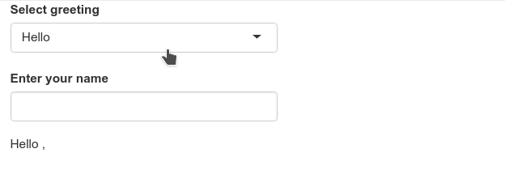

# Wrapup

## Learn yourself {.build}

1. [https://shiny.rstudio.com/gallery/](https://shiny.rstudio.com/gallery/)
2. [https://github.com/rstudio/shiny-examples](https://github.com/rstudio/shiny-examples)

## Any questions? {.build}

Don't forget to follow Twitter: @RLadiesJakarta. 

All materials are available on GitHub: [https://github.com/rladiesjakarta](https://github.com/rladiesjakarta)
